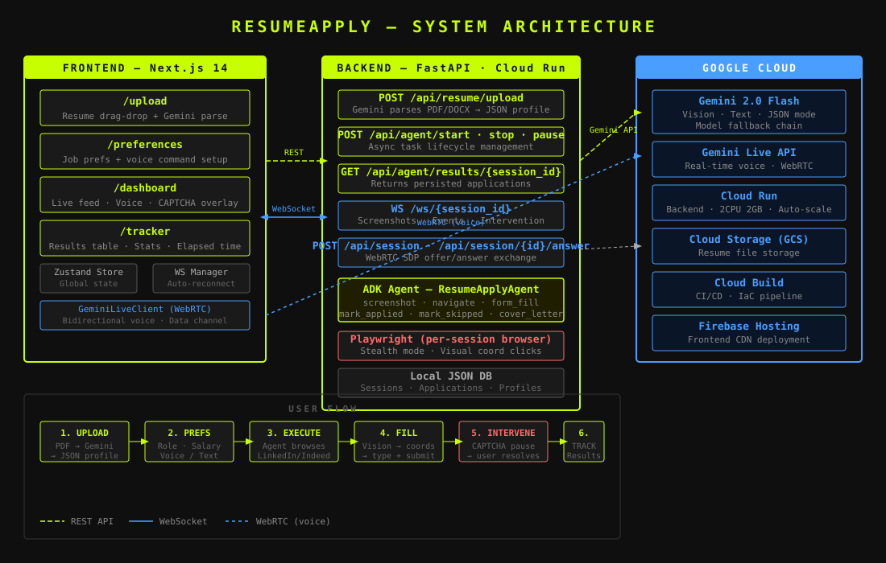

# ResumeApply: The Autonomous Job Search Agent

[](https://aistudio.google.com/)
[](https://opensource.org/licenses/MIT)
[](https://cloud.google.com/run)

**ResumeApply** is an autonomous job application agent built for the **Google Gemini Live Agent Challenge**. It combines real-time WebRTC voice commands with Gemini multimodal vision to control a real browser — finding jobs, filling forms, and hitting Submit on your behalf.

---

## Architecture



---

## Key Features

- **Voice Control** — Talk to the agent live via Gemini Multimodal Live API + WebRTC. Say "Apply to senior React roles in NYC above 180k" and watch it go.
- **Multimodal Vision** — The agent *sees* the browser via screenshots analyzed by Gemini 2.0 Flash. No DOM scraping, no brittle CSS selectors — pure visual understanding.
- **Autonomous Form Filling** — Gemini maps resume data to form fields and types into each one using coordinate-based clicks.
- **Human-in-the-Loop** — CAPTCHA or MFA detected? Agent pauses, alerts you via WebSocket overlay, resumes when you click Done.
- **Live Dashboard** — Real-time browser feed, agent reasoning stream, voice command panel, and application stats — all updating over WebSocket.
- **Google Cloud Native** — Backend on Cloud Run, CI/CD via Cloud Build, resume storage on GCS.

---

## Tech Stack

| Layer | Technologies |
| :--- | :--- |
| Frontend | Next.js 14, Zustand, GSAP, TailwindCSS, WebRTC |
| Backend | FastAPI, Python 3.11, WebSockets |
| AI | Gemini 2.0 Flash (Vision + Text), Gemini Live API, Google ADK |
| Browser Engine | Playwright (stealth mode, per-session instances) |
| Cloud | Google Cloud Run, Google Cloud Build, Google Cloud Storage |
| Storage | GCS (resumes), Local JSON DB (sessions) |

---

## Spin-Up Instructions

### Prerequisites
- Python 3.11+
- Node.js 20+
- A Gemini API key from [Google AI Studio](https://aistudio.google.com/)
- (For GCP deploy) `gcloud` CLI authenticated

### 1. Clone & configure

```bash
git clone https://github.com/LSUDOKO/ResumeApply.git
cd ResumeApply
```

**Backend** — create `backend/.env`:
```env
GEMINI_API_KEY=your_gemini_api_key
PROJECT_ID=your_gcp_project_id
GCS_BUCKET=your_gcs_bucket_name
```

**Frontend** — create `frontend/.env.local`:
```env
NEXT_PUBLIC_API_URL=http://localhost:8000
NEXT_PUBLIC_WS_URL=ws://localhost:8000
```

### 2. Run the backend

```bash
cd backend
python -m venv venv
source venv/bin/activate
pip install -r requirements.txt
playwright install chromium
python main.py
```

Backend runs at `http://localhost:8000`. API docs at `http://localhost:8000/docs`.

### 3. Run the frontend

```bash
cd frontend
npm install
npm run dev
```

Frontend runs at `http://localhost:3000`.

### 4. Use the app

1. Go to `http://localhost:3000`
2. Upload your resume (PDF or DOCX)
3. Set job preferences (role, salary, remote)
4. Click **Unleash the Agent**
5. Watch the live browser feed on the dashboard

---

## Google Cloud Deployment

### Automated (Cloud Build IaC)

```bash
gcloud builds submit \
  --config deployment/cloudbuild.yaml \
  --substitutions _GEMINI_API_KEY="your_key",_GCS_BUCKET="your_bucket",_FIREBASE_TOKEN="your_token"
```

This will:
1. Build and push the backend Docker image to GCR
2. Deploy backend to Cloud Run (2 CPU, 2GB RAM, us-central1)
3. Build and deploy frontend to Firebase Hosting

### Manual Cloud Run deploy

```bash
# Build image
docker build -t gcr.io/YOUR_PROJECT_ID/resumeapply-backend ./backend
docker push gcr.io/YOUR_PROJECT_ID/resumeapply-backend

# Deploy to Cloud Run
gcloud run deploy resumeapply-backend \
  --image gcr.io/YOUR_PROJECT_ID/resumeapply-backend \
  --region us-central1 \
  --platform managed \
  --allow-unauthenticated \
  --memory 2Gi \
  --cpu 2 \
  --set-env-vars GEMINI_API_KEY=your_key,GCS_BUCKET=your_bucket
```

---

## Repository Structure

```
ResumeApply/
├── backend/
│   ├── agents/resume_agent.py      # ADK agent with full LinkedIn workflow
│   ├── tools/
│   │   ├── screenshot_tool.py      # Gemini Vision analysis + WS broadcast
│   │   ├── navigate_tool.py        # Visual click/type/fill via coordinates
│   │   └── form_fill_tool.py       # Field mapping + actual browser filling
│   ├── routers/
│   │   ├── resume.py               # Upload + Gemini parse endpoint
│   │   ├── agent.py                # Start/stop/pause/results endpoints
│   │   ├── websocket.py            # Real-time WS + intervention handling
│   │   └── session.py              # WebRTC session for Gemini Live voice
│   ├── lib/
│   │   ├── gemini_helper.py        # Model fallback chain
│   │   ├── local_db.py             # JSON session + application storage
│   │   └── session_context.py      # Async context var for session ID
│   └── main.py
├── frontend/
│   ├── app/
│   │   ├── upload/                 # Resume drag-drop + Gemini extraction
│   │   ├── preferences/            # Job preferences + agent config
│   │   ├── dashboard/              # Live feed + voice + CAPTCHA overlay
│   │   └── tracker/                # Results table + stats
│   ├── components/
│   │   ├── BrowserFeed.tsx         # Live screenshot stream
│   │   ├── AgentThinking.tsx       # Agent reasoning display
│   │   └── VoiceCommand.tsx        # WebRTC voice interface
│   └── lib/
│       ├── store.ts                # Zustand global state
│       ├── websocket.ts            # WS manager with auto-reconnect
│       └── geminiLive.ts           # WebRTC peer connection
├── deployment/
│   └── cloudbuild.yaml             # Cloud Build IaC pipeline
└── docs/
    └── architecture.svg            # System architecture diagram
```

---

## Workflow

1. **Upload** — Drop your resume. Gemini extracts name, role, skills, experience as structured JSON.
2. **Preferences** — Set target role, min salary, job type. Voice or text.
3. **Execute** — Agent opens LinkedIn, logs in, searches, filters by Easy Apply, evaluates match score.
4. **Fill & Submit** — Gemini maps your profile to each form field. Agent types and submits.
5. **Intervene** — CAPTCHA? Dashboard shows an overlay. You resolve it, click Done, agent continues.
6. **Track** — Every application logged with company, role, match score, and timestamp.

---

## Google Cloud Services Used

- **Cloud Run** — Serverless backend hosting (auto-scales, handles WebSocket connections)
- **Cloud Build** — Automated CI/CD pipeline (IaC, bonus point)
- **Google Cloud Storage** — Resume file storage
- **Gemini 2.0 Flash** — Vision reasoning, form mapping, cover letter generation
- **Gemini Live API** — Real-time bidirectional voice via WebRTC

---

## License

MIT License. Created by [Bajrangi](https://github.com/LSUDOKO) for the Google Gemini Live Agent Challenge.
