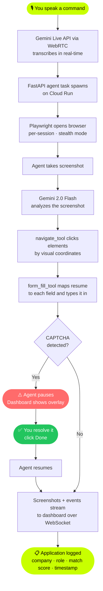

<div align="center">


<br /><br />

```
██████╗ ███████╗███████╗██╗   ██╗███╗   ███╗███████╗ █████╗ ██████╗ ██████╗ ██╗  ██╗   ██╗
██╔══██╗██╔════╝██╔════╝██║   ██║████╗ ████║██╔════╝██╔══██╗██╔══██╗██╔══██╗██║  ╚██╗ ██╔╝
██████╔╝█████╗  ███████╗██║   ██║██╔████╔██║█████╗  ███████║██████╔╝██████╔╝██║   ╚████╔╝ 
██╔══██╗██╔══╝  ╚════██║██║   ██║██║╚██╔╝██║██╔══╝  ██╔══██║██╔═══╝ ██╔═══╝ ██║    ╚██╔╝  
██║  ██║███████╗███████║╚██████╔╝██║ ╚═╝ ██║███████╗██║  ██║██║     ██║     ███████╗██║   
╚═╝  ╚═╝╚══════╝╚══════╝ ╚═════╝ ╚═╝     ╚═╝╚══════╝╚═╝  ╚═╝╚═╝     ╚═╝     ╚══════╝╚═╝   
```

### Your job search, **AUTOMAT\*D.**

*An autonomous AI agent that talks to you, sees the web, and applies to jobs — while you do literally anything else.*

</div>

---

## What is this?

ResumeApply is a **UI Navigator agent** built for the Google Gemini Live Agent Challenge.

You upload your resume. You say "Apply to senior React roles in NYC above 180k." The agent opens a real browser, navigates LinkedIn, reads job listings with its eyes (Gemini Vision), fills every form field, and hits Submit — all while streaming a live feed back to your dashboard.

No DOM scraping. No brittle CSS selectors. Pure multimodal visual understanding.

---

## Architecture


---

## How it works



---

## Features

**1. Voice-first control**
Talk to the agent live. Powered by Gemini Multimodal Live API over WebRTC. Interrupt it mid-session. It listens.

**2. Multimodal vision**
The agent sees the browser the same way you do — screenshots analyzed by Gemini 2.0 Flash. It finds buttons, inputs, and job cards by visual description, not code.

**3. utonomous form filling**
Gemini maps your resume profile to every form field. The agent clicks the field by coordinate, clears it, and types your data. Multi-step forms handled step by step.

**4. Human-in-the-loop**
CAPTCHA or MFA detected? The agent pauses, sends a WebSocket alert, and shows an overlay on your dashboard. You resolve it, click Done, agent resumes exactly where it left off.

**5. Live dashboard**
Real-time browser feed, agent reasoning stream, voice command panel, application counter — all updating over WebSocket as the agent works.

**6. Google Cloud native**
Backend on Cloud Run. CI/CD via Cloud Build. Resume storage on GCS. Automated IaC deployment in one command.

---

## Tech Stack

| Layer | Tech |
|---|---|
| Frontend | Next.js 14, TypeScript, Zustand, GSAP, TailwindCSS |
| Backend | FastAPI, Python 3.11, WebSockets, asyncio |
| AI | Gemini 2.0 Flash (Vision + Text), Gemini Live API, Google ADK |
| Browser | Playwright — stealth mode, per-session instances |
| Cloud | Cloud Run, Cloud Build, Cloud Storage, Firebase Hosting |

---

## Quickstart

### Prerequisites

- Python 3.11+
- Node.js 20+
- Gemini API key from [Google AI Studio](https://aistudio.google.com/)

### 1. Clone

```bash
git clone https://github.com/LSUDOKO/ResumeApply.git
cd ResumeApply
```

### 2. Configure environment

`backend/.env`:
```env
GEMINI_API_KEY=your_gemini_api_key
PROJECT_ID=your_gcp_project_id
GCS_BUCKET=your_gcs_bucket_name
```

`frontend/.env.local`:
```env
NEXT_PUBLIC_API_URL=http://localhost:8000
NEXT_PUBLIC_WS_URL=ws://localhost:8000
```

### 3. Backend

```bash
cd backend
python -m venv venv
source venv/bin/activate
pip install -r requirements.txt
playwright install chromium
python main.py
```

Runs at `http://localhost:8000` — API docs at `/docs`.

### 4. Frontend

```bash
cd frontend
npm install
npm run dev
```

Runs at `http://localhost:3000`.

### 5. Run it

1. Go to `http://localhost:3000`
2. Drop your resume (PDF or DOCX)
3. Set your target role, salary, job type
4. Click **Unleash the Agent**
5. Watch the live browser feed

---

## Google Cloud Deployment

### One command (IaC via Cloud Build)

```bash
gcloud builds submit \
  --config deployment/cloudbuild.yaml \
  --substitutions \
    _GEMINI_API_KEY="your_key",\
    _GCS_BUCKET="your_bucket",\
    _FIREBASE_TOKEN="your_token"
```

This builds the Docker image, pushes to GCR, deploys to Cloud Run (2 CPU / 2GB), and deploys the frontend to Firebase Hosting.

### Manual Cloud Run deploy

```bash
# Build + push
docker build -t gcr.io/YOUR_PROJECT_ID/resumeapply-backend ./backend
docker push gcr.io/YOUR_PROJECT_ID/resumeapply-backend

# Deploy
gcloud run deploy resumeapply-backend \
  --image gcr.io/YOUR_PROJECT_ID/resumeapply-backend \
  --region us-central1 \
  --platform managed \
  --allow-unauthenticated \
  --memory 2Gi \
  --cpu 2 \
  --set-env-vars GEMINI_API_KEY=your_key,GCS_BUCKET=your_bucket
```

---

## Repository Structure

```
ResumeApply/
├── backend/
│   ├── agents/
│   │   └── resume_agent.py         # ADK agent — full LinkedIn workflow
│   ├── tools/
│   │   ├── screenshot_tool.py      # Gemini Vision + WS broadcast (per-session browser)
│   │   ├── navigate_tool.py        # Visual click / type / fill / scroll
│   │   └── form_fill_tool.py       # Field mapping + actual browser filling + DB persist
│   ├── routers/
│   │   ├── resume.py               # POST /api/resume/upload
│   │   ├── agent.py                # start / stop / pause / resume / results
│   │   ├── websocket.py            # WS manager + intervention futures
│   │   └── session.py              # WebRTC SDP offer/answer for Gemini Live
│   ├── lib/
│   │   ├── gemini_helper.py        # Model fallback: flash → 2.0-flash → pro
│   │   ├── local_db.py             # JSON session + application storage
│   │   └── session_context.py      # contextvars session ID for async tools
│   ├── main.py                     # FastAPI app + router registration
│   ├── requirements.txt
│   └── Dockerfile
├── frontend/
│   ├── app/
│   │   ├── page.tsx                # Landing — GSAP hero, feature cards
│   │   ├── upload/page.tsx         # Resume drag-drop + extraction animation
│   │   ├── preferences/page.tsx    # Job prefs + agent preview
│   │   ├── dashboard/page.tsx      # Live feed + voice + CAPTCHA overlay
│   │   └── tracker/page.tsx        # Results table + real elapsed time
│   ├── components/
│   │   ├── BrowserFeed.tsx         # Live screenshot stream
│   │   ├── AgentThinking.tsx       # Agent reasoning display
│   │   ├── VoiceCommand.tsx        # WebRTC push-to-talk
│   │   └── StatsBar.tsx            # Applied / skipped / time counters
│   └── lib/
│       ├── store.ts                # Zustand global state
│       ├── websocket.ts            # WS manager with auto-reconnect
│       └── geminiLive.ts           # WebRTC peer connection to Gemini Live
├── deployment/
│   └── cloudbuild.yaml             # Cloud Build IaC pipeline
└── docs/
    └── architecture.svg            # System architecture diagram
```

---

## API Reference

| Method | Endpoint | Description |
|---|---|---|
| POST | `/api/resume/upload` | Upload resume, returns session_id + parsed profile |
| POST | `/api/agent/start` | Start agent with session_id + preferences |
| POST | `/api/agent/stop` | Cancel running agent task |
| POST | `/api/agent/pause` | Broadcast pause event to agent |
| POST | `/api/agent/resume` | Broadcast resume event to agent |
| GET | `/api/agent/results/{session_id}` | Get all applications for a session |
| GET | `/api/agent/status/{session_id}` | Check if agent task is running |
| POST | `/api/session` | Create WebRTC session for Gemini Live voice |
| POST | `/api/session/{id}/answer` | Submit WebRTC SDP answer |
| WS | `/ws/{session_id}` | Real-time event stream |

---

## Google Cloud Services

| Service | Usage |
|---|---|
| Gemini 2.0 Flash | Vision reasoning, form field mapping, cover letter generation |
| Gemini Live API | Real-time bidirectional voice via WebRTC |
| Cloud Run | Serverless backend — auto-scales, handles long-lived WebSocket connections |
| Cloud Build | Automated CI/CD pipeline (IaC — qualifies for bonus point) |
| Cloud Storage | Resume file storage |
| Firebase Hosting | Frontend CDN deployment |

---

## License

MIT — built by [Bajrangi](https://github.com/LSUDOKO) for the Google Gemini Live Agent Challenge.
